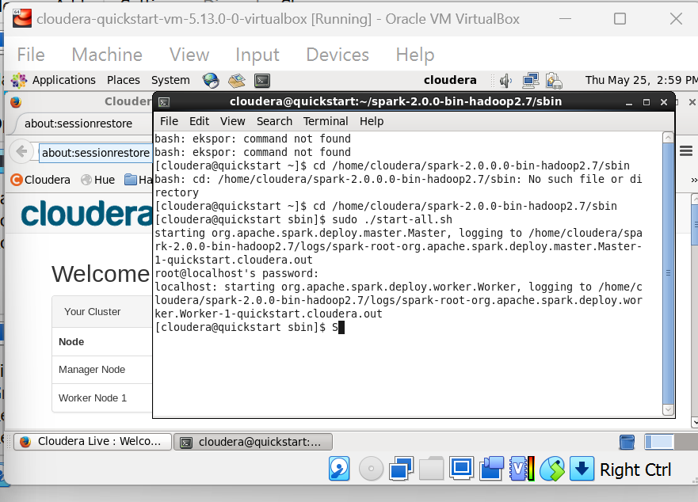
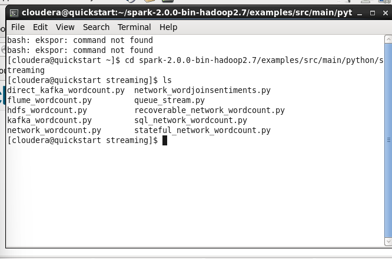
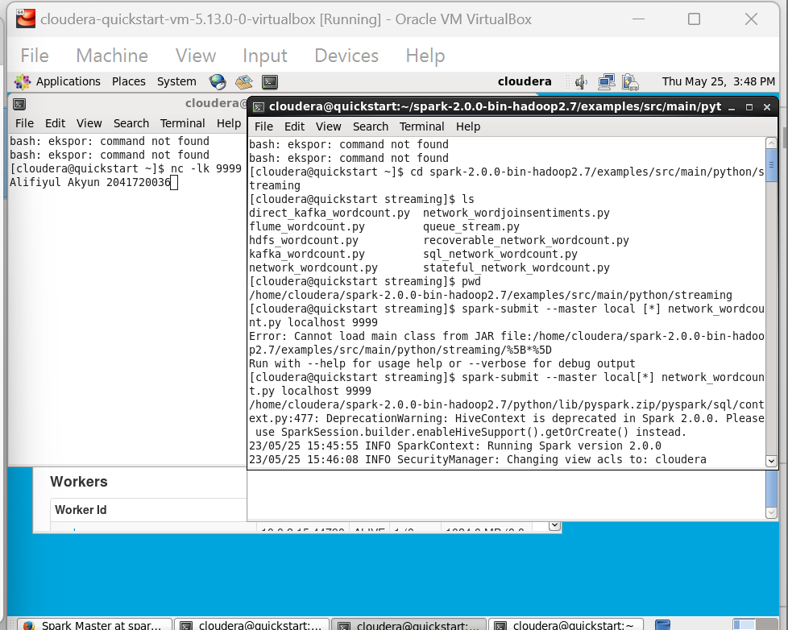

# spark-streaming

# Big-Data
Tugas - Tugas Mata Kuliah Big Data

## Chapter 5
Real-Time Analytics with Spark Streaming and Structured Streaming

# Tugas Praktikum

## Memulai Spark

## Masuk Folder

## Data

**3. TUGAS PRAKTIKUM**
<table border="0">
 <tr>
    <th colspan="2" align="center"><b>Jelaskan perbedaan spark streaming dengan metode stateless dan stateful stream processing!</b></th>
 </tr>
 <tr>
    <td>Perbedaannya adalah jika pada stateful, state dari peristiwa sebelumnya tetap ada dan memengaruhi peristiwa selanjutnya. sedangkan dalam stateless, state tidak persisten.</td>
 </tr>
 </table>
 <table border="0">
 <tr>
    <th colspan="2" align="center"><b>Jelasakan masing-masing maksud kode berikut sesuai nomor kodenya!</b></th>
 </tr>
 <tr>
    <td><b style="font-size:30px">Kode</b></td>
    <td><b style="font-size:30px">Keterangan</b></td>
 </tr>
 <tr>
    <td>sys.argv</td>
    <td>sys.argv adalah list pada python yang berisi semua perintah pada command-line</td>
 </tr>
 <tr>
    <td>sys.stderr</td>
    <td>sys.stderr mencetak langsung ke konsol berupa pesan pengecualian (exception) dan kesalahan</td>
    <tr>
    <td>StreamingContext</td>
    <td>StreamingContext mewakili koneksi ke cluster Spark dan dapat digunakan untuk membuat berbagai sumber input DStream</td>
 </tr>
 <tr>
    <td>sc</td>
    <td>Default dari PySpark SparkContext</td>
 </tr>
 <tr>
    <td>socketTextStream</td>
    <td>Buat input dari nama host sumber TCP: port. Data diterima menggunakan soket TCP dan menerima byte ditafsirkan sebagai UTF8 yang disandikan \n baris yang dibatasi.</td>
 </tr>
 <tr>
    <td>reduceByKey</td>
    <td>Transformasi digunakan untuk menggabungkan nilai setiap kunci menggunakan fungsi pengurangan asosiatif pada PySpark RDD.</td>
 </tr>
 <tr>
    <td>lambda line</td>
    <td></td>
 </tr>
 <tr>
    <td>awaitTermination</td>
    <td>Menunggu penghentian kueri ini, baik dengan kueri. stop() atau dengan pengecualian. Jika kueri telah diakhiri dengan pengecualian, maka pengecualian akan dilemparkan.</td>
 </tr>
 <tr>
    <td>nc</td>
    <td>Utilitas nc (atau netcat) digunakan untuk apa saja di bawah matahari yang melibatkan TCP atau UDP. Itu dapat membuka koneksi TCP, mengirim paket UDP, mendengarkan port TCP dan UDP yang sewenang-wenang, melakukan pemindaian port, dan menangani IPv4 dan IPv6</td>
 </tr>
 <tr>
    <td>lk</td>
    <td>-l adalah untuk listen pada port, sedangkan -k untuk menjaga agar listener terbuka</td>
    <tr>
 </tr>
 <tr>
    <td>spark-submit</td>
    <td>Skrip spark-submit di direktori bin Spark digunakan untuk meluncurkan aplikasi di cluster</td>
 </tr>
 <tr>
    <td>master</td>
    <td>URL master untuk kluster</td>
    <tr>
 </tr>
 <tr>
    <td>local[*]</td>
    <td>Menjalankan Spark secara lokal dengan thread pekerja sebanyak inti logis di mesin Anda.</td>
    <tr>
 </tr>
 <tr>
    <td>ssc.checkpoint</td>
    <td>Mengatur direktori pos pemeriksaan</td>
 </tr>
 <tr>
    <td>parallelize</td>
    <td>PySpark parallelize() adalah fungsi di SparkContext dan digunakan untuk membuat RDD dari kumpulan daftar</td>
    <tr>
 </tr>
 <tr>
    <td>updateStateByKey</td>
    <td>Kembalikan DStream "status" baru di mana status untuk setiap kunci diperbarui dengan menerapkan fungsi yang diberikan pada status kunci sebelumnya dan nilai baru untuk kunci tersebut. Ini dapat digunakan untuk memelihara data status arbitrer untuk setiap kunci.</td>
    <tr>
 </tr>
 <tr>
    <td>flatMap</td>
    <td>flatMap() adalah operasi transformasi yang meratakan RDD/DataFrame (array/memetakan kolom DataFrame) setelah menerapkan fungsi pada setiap elemen dan mengembalikan PySpark RDD/DataFrame baru.</td>
    <tr>
 </tr>
 <tr>
    <td>rdd.take(5)</td>
    <td>Ambil 5 elemen pertama dari RDD</td>
 </tr>
 <tr>
    <td>transform</td>
    <td>ransform() digunakan untuk menerapkan transformasi pada kolom bertipe Array.</td>
    <tr>
 </tr>
 <tr>
    <td>rdd.sortByKey(False)</td>
    <td>Sort dengan descending order</td>
    <tr>
 </tr>
</table>
